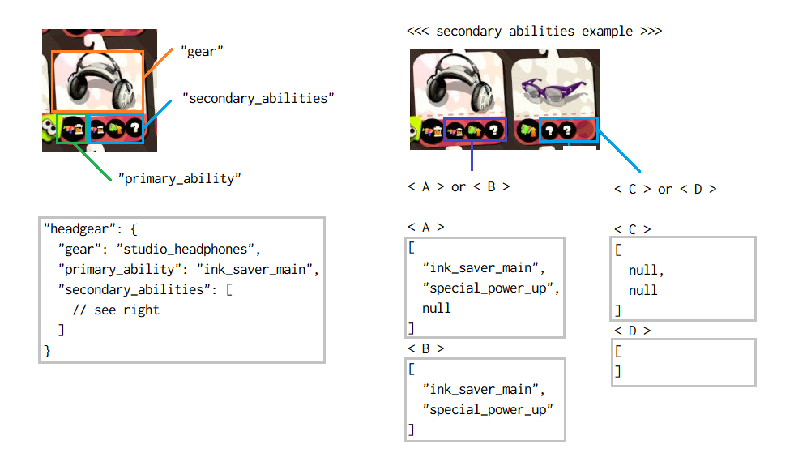

`POST /api/v2/battle`
===================

| | |
|-|-|
|Verb|`POST`|
|URL|`https://stat.ink/api/v2/battle`|
|Return-Type|成功した場合 `201 Created` (bodyなし)<br>失敗した場合 `application/json` または `text/html`<br>既に存在した場合 `302 Found`|
|Auth|[Needed](authorization.md)|

バトルデータをstat.inkに投稿します。

投稿時のリクエストボディの形式については[request-body.md](request-body.md)を参照してください。

投稿が成功したとき、結果はHTTPレスポンスヘッダに次のように返却されます。

|レスポンスヘッダ<br>Response Header|値の例<br>Example|意味<br>Meaning|
|-|-|-|
|`Location`|`https://stat.ink/@username/spl2/42`|ブラウザで表示するバトル詳細ページです|
|`X-Api-Location`|`https://stat.ink/api/v2/battle/42`|APIで利用するためのURLです|
|`X-User-Screen-Name`|`username`|URL中に含まれるユーザ名です|
|`X-Battle-Id`|`42`|バトルを識別する番号です|


Parameters パラメータ
--------------------

基本的に全てのパラメータは省略可能です。ただし、あまりに内容がない場合はエラーになります。

POST データは全体で 12MiB 以内である必要があります。

|キー<br>Param. name|値の型<br>Type||
|-|-|-|
|`uuid`|文字列(64文字以下)<br>推奨:[UUID](https://tools.ietf.org/html/rfc4122)|バトル重複のチェックに使用します。<br>同一UUIDのPOSTが一定期間内に行われた場合、サーバは保存せずに以前の情報を返します。（後述）|
|`splatnet_number`|整数(1～)|イカリング2(SplatNet 2)のバトル番号(`battle_number`)を指定します。|
|`lobby`|指定文字列|どのロビーからバトルを行ったかを指定します。（後述）|
|`mode`|指定文字列|どのプレーモードでバトルを行ったかを指定します。（後述）|
|`rule`|指定文字列|どのルールでバトルを行ったかを指定します。（後述）|
|`stage`|指定文字列|どのステージ（マップ）でバトルを行ったかを指定します。（後述）|
|`weapon`|指定文字列|このバトルを投稿するプレーヤーがどのブキを使用したかを指定します。（後述）|
|`result`|指定文字列|バトルの勝敗に応じた値を設定します。<br>`win` : 勝利<br>`lose` : 敗北|
|`knock_out`|指定文字列|ガチマッチルールで終了方法に応じた値を設定します。<br>`yes` : ノックアウト勝ち/負け<br>`no` : 時間切れ勝ち/負け|
|`rank_in_team`|整数(1～4)|プレーヤーがリザルト画面のチーム内何番目に表示されたかを指定します。|
|`kill`|整数(0～99)|プレーヤーのキルの数を指定します。|
|`death`|整数(0～99)|プレーヤーのデスの数を指定します。|
|`max_kill_combo`|整数(0～)|「たおした」表示中にさらにキルしたことを「コンボ」と定義したときのバトル中の最大のコンボ数を指定します。|
|`max_kill_streak`|整数(0～)|バトル開始またはリスポーンからデスするまたは試合終了までのキル(=行動不能までに何キル連続したか)を「ストリーク」と定義したときのバトル中の最大のストリーク数を指定します。|
|`kill_or_assist`|整数(0～)|プレーヤーのキル数+アシスト数を指定します。(Splatoon 2仕様のスコアボード用)|
|`special`|整数(0～)|プレーヤーのスペシャル使用数を指定します。(Splatoon 2仕様のスコアボード用)|
|`freshness`|数値(0.0～99.9)|チョーシの値を指定します。|
|`level`|整数(1～99)|プレーヤーのバトル開始時のランクを指定します。|
|`level_after`|整数(1～99)|同様にバトル終了後のランクを指定します。|
|`star_rank`|整数(0～)|ランク99後にリセットして★1になった回数を指定します。イカリング2 (SplatNet 2) で `star_rank` がわかる場合はその値を、単に★がついていることしかわからない場合は 1 を指定します。|
|`rank`|指定文字列|プレーヤーのバトル開始時のウデマエを指定します。|
|`rank_exp`|整数(0～50)|S+, バトル開始時のウデマエの数字を指定します。|
|`rank_after`|指定文字列|プレーヤーのバトル終了時のウデマエを指定します。|
|`rank_exp_after`|整数(0～50)|S+, バトル終了時のウデマエの数字を指定します。|
|`x_power`|Number(0.0～9999.9?)|X Power (before the battle)|
|`x_power_after`|Number(0.0～9999.9?)|X Power (after the battle)|
|`estimate_x_power`|Integer(0～)|Estimated X Power|
|`my_point`|整数(0～)|自分が塗ったポイントと勝利ボーナスを合計した数値を指定します。（画面に表示されるままのポイント）|
|`estimate_gachi_power`|整数|推定ガチパワーを指定します。|
|`league_point`|数値(e.g.1234.5)|リーグパワーを指定します。|
|`my_team_estimate_league_point`|整数|自分のチームの推定リーグパワーを指定します。|
|`his_team_estimate_league_point`|整数|相手のチームの推定リーグパワーを指定します。|
|`my_team_point`|整数(0～)|リザルト画面の自分のチームの最終塗りポイントを指定します。|
|`his_team_point`|整数(0～)|同様に敵チームのポイントを指定します。|
|`my_team_percent`|数値(0.0～100.0)|同様に自分のチームの塗りポイントのパーセンテージを指定します。|
|`his_team_percent`|数値(0.0～100.0)|同様に敵チームのパーセンテージを指定します。|
|`my_team_count`|整数(0～100)|リザルト画面の自分のチームの最終的な取得カウントを指定します。（ガチマッチ用、初期0、ノックアウト100）|
|`his_team_count`|整数(0～100)|同様に敵チームのカウントを指定します。|
|`my_team_id`|文字列|イカリング2(SplatNet 2)JSON中の自チームを特定するためのIDを指定します。(`tag_id` ?)|
|`his_team_id`|文字列|同様に敵チームを特定するためのIDを指定しますが、おそらく取得できないと思います。|
|`species`|指定文字列|イカまたはタコの種別を指定します。<br>Specify species (Inklings or Octolings)<br>`inkling` : イカ - Inklings<br>`octoling` : タコ (Octolings)|
|`gender`|指定文字列|自分のイカの性別を指定します。この項目はフェスで使用します。<br>`boy` : ボーイ<br>`girl` : ガール|
|`fest_title`|指定文字列|フェスの称号を指定します。|
|`fest_exp`|整数(0～999)|フェスの経験値を指定します。「カリスマ 42/99」の 42|
|`fest_title_after`|指定文字列|フェスの称号を指定します。（バトル後の値）|
|`fest_exp_after`|整数(0～999)|フェスの経験値を指定します。（バトル後の値）|
|`fest_power`|数値(e.g. 1234.5)|フェスパワーを指定します。|
|`my_team_estimate_fest_power`|整数|自チームの概算フェスパワーを指定します。|
|`his_team_estimate_fest_power`|整数|敵チームの概算フェスパワーを指定します。|
|`my_team_fest_theme`|文字列<br>String|フェスの自チームのお題を指定します。<br>Player team's theme<br>例: たけのこの里<br>e.g. Ice Cream|
|`his_team_fest_theme`|文字列<br>String|フェスの敵チームのお題を指定します。<br>Enemy team's theme|
|`my_team_nickname`|文字列<br>String|フェスの自チームのニックネームを指定します。<br>Player team's nickname on Splatfest<br>例: メガネシューターイカグループ<br>e.g. The Nearsighted Shooter Squid Warriors|
|`his_team_nickname`|文字列<br>String|フェスの敵チームのニックネームを指定します。<br>Enemy team's nickname on Splatfest|
|`clout`|整数(0～)<br>Integer(0-)|フェスバトルで得た貢献度を指定します。<br>Obtained clout<br>Note: `total_clout` + `clout` = `total_clout_after`|
|`total_clout`|整数(0～)<br>Integer(0-)|合計貢献度（バトル前）を指定します。<br>Total clout value (before the battle)|
|`total_clout_after`|整数(0～)<br>Integer(0-)|合計貢献度（バトル後）を指定します。<br>Total clout value (after the battle)|
|`synergy_bonus`|数値(1.0～9.9)<br>Number(1.0-9.9)|おそろいボーナスの倍率（1.0, 1.5など）を指定します。<br>Synergy bonus (e.g. 1.0, 1.5)|
|`my_team_win_streak`|整数<br>Integer|自分のチームの連勝数を指定します。<br>Win streak (Good guys)|
|`his_team_win_streak`|整数<br>Integer|敵のチームの連勝数を指定します。<br>Win streak (Bad guys)|
|`special_battle`|指定文字列<br>Key|フェスのレアバトルの種類を指定します。<br>Specify special battle on Splatfest<br>`10x`: 10倍バトル - 10x Battle<br>`100x`: 100倍バトル - 100x Battle|
|`gears`|構造体|プレーヤーのギア構成を指定します。（後述）<br>Specify gear configuration (the player)|
|`players`|構造体|自分を含めた両チーム8人分のデータを指定します。（後述）|
|`death_reasons`|マップ|自分が死んだ死因を指定します。（後述）|
|`events`|配列|ゲーム中の進行状況に対応する時系列データを指定します。（後述）|
|`splatnet_json`|オブジェクト or 文字列|イカリング2(SplatNet 2)のバトルを示すJSONをそのまま指定します。JSONをデコードしたオブジェクトをそのまま指定しても、JSONを文字列としてシリアライズした結果を指定しても構いません。|
|`automated`|指定文字列|自動化された投稿か手動による投稿かを指定します。<br>この情報は、全体統計に使用できるかを判定するのに使用します。<br>（意図的に勝利データのみを送信するのが容易かを示すものと考えてください）<br>`yes` : 自動化されている（機械的に処理されている）<br>`no` : 自動化されていない（手動入力等）|
|`link_url`|文字列(URL)|このバトルに関連したURLを指定します。<br>一般的には、バトルの録画をアップロードしたYouTubeへのURLを指定します。|
|`note`|文字列|このバトルに関連するメモを指定します。|
|`private_note`|文字列|同様ですが、本人以外には表示不可能な秘密のメモを指定します。|
|`agent`|文字列(64文字以下)|投稿に利用するクライアントの名称を指定します。<br>例えば `IkaLog` などのソフトウェアの名称を指定します。<br>他のクライアントと重複しないような名前をつけてください。<br>これを指定するとき、`agent_version`も指定必須となります。|
|`agent_version`|文字列(255文字以下)|`agent`で示されるクライアントのバージョン情報を指定します。<br>アーキテクチャやOSに関する情報を含めることもできます。|
|`agent_custom`|文字列|クライアントがクライアント自身のために利用するデータを指定できます。stat.inkは内容には関知しません。|
|`agent_variables`|マップ|クライアント定義のキー・バリューを指定出来ます。（後述）|
|`image_judge`|画像バイナリ(PNG/JPEG)|ジャッジ画面のスクリーンショットを指定します。|
|`image_result`|画像バイナリ(PNG/JPEG)|リザルト画面（8人分のデータが並んだ画面）のスクリーンショットを指定します。|
|`image_gear`|画像バイナリ(PNG/JPEG)|ギア構成画面のスクリーンショットを指定します。|
|`start_at`|整数(UNIX時間)|バトル開始日時をunix時間（単位は秒）で指定します。|
|`end_at`|整数(UNIX時間)|バトル終了日時をunix時間（単位は秒）で指定します。|

Note: Value-Types:

- "文字列": "String"

  - "_N_ 文字以下": "_N_ characters or few"

- "指定文字列": "Pre-defined string" (key-string)

- "整数": "Integer"

  - "整数(UNIX時間)": "Integer (UNIX time)" (Seconds from 1970-01-01T00:00:00+00:00 (Jan 1st 1970 00:00:00 GMT/UTC, British Time))

  - "_N_ ～": "_N_ or upper"

  - "_N_ ～ _M_": "_N_ ≤ (value) ≤ _M_"
  
- "数値": "Number"

- "画像バイナリ": "Binary-data of image"

- "構造体": "Structure"

- "配列": "Array"

- "マップ": "Map" (associative array)

`uuid`
------

`uuid` が指定されるとき、サーバは次のように振る舞います。<br>
If you set a `uuid`, stat.ink behaves as follows.

```
if already_has_same_uuid_battle?        // 同じUUIDのバトルがある?
  then
    if is_same_user? and is_recently?   // 同じユーザで最近投稿された?
      then
        [ skip_register_new_battle ]    // 新しいバトルを登録しない
        return "HTTP 302 Found"

[ register_new_battle ]                 // 新しいバトルを登録する
return "HTTP 201 Created"
```

「最近」は現在の所、1日(86400秒)です。<br>
"recently" means 1 day (86400 seconds) at this time. (There is no consideration for DST.)

クライアントは次のように生成して送信することを推奨します。<br>
I strongly recommend the client generate and transmit UUID as follows:

- スタンドアロンアプリケーション / Standalone Application (like IkaLog, IkaRec or "stat.ink web client")

  - ランダムなUUID(UUID v4)を生成する<br>Generate a random-based UUID (UUID version 4)

  - 独自の名前空間を定義の上、UUID v5を生成する<br>Define your own namespace-UUID and generate UUID version 5 with that NS-UUID

  - 何も送信しない<br>Nothing generate

- イカリング2ベースのアプリケーション / SplatNet 2-based Application (like SquidTracks or splatnet2statink)

  - 専用の名前空間 `73cf052a-fd0b-11e7-a5ee-001b21a098c2` を利用して UUID v5 を生成する<br>Generate a UUID version 5 with namespace `73cf052a-fd0b-11e7-a5ee-001b21a098c2`

    - 値には `バトル番号(battle_number)` `@` `プレーヤーID(principal_id)` を使用します。（例: `42@abc123`）<br>
      Use `battle_number` `@` `principal_id`. (Example: `42@abc123`)<br>
      `uuid_v5("73cf052a-fd0b-11e7-a5ee-001b21a098c2", sprintf("%d@%s", battle_id, principal_id))`

    - この名前空間はこのフォーマットにのみ利用してください。<br>
      Please use this namespace-UUID for this format only.

  - 独自の名前空間を定義の上、UUID v5を生成する<br>Define your own namespace-UUID and generate UUID version 5 with that NS-UUID


| 種類<br>App type             | UUID version | 名前空間<br>Namespace                  | 生成元の値<br>generate from                          |
|------------------------------|--------------|----------------------------------------|------------------------------------------------------|
| スタンドアロン<br>Standalone | version 4    | N/A                                    | N/A (Random)                                         |
| スタンドアロン<br>Standalone | version 5    | 独自<br>You defined                    | 独自<br>You defined (like `seqencial_id@install_id`) |
| イカリング2<br>SplatNet 2    | version 5    | `73cf052a-fd0b-11e7-a5ee-001b21a098c2` | `battle_number@principal_id` (e.g. `42@abc123`)      |
| イカリング2<br>SplatNet 2    | version 5    | 独自<br>You defined                    | 独自<br>You defined                                  |


UUID v5 （名前空間 `73cf052a-fd0b-11e7-a5ee-001b21a098c2` を利用するとき）の生成値の例<br>
Example for UUID v5 (if use namespace `73cf052a-fd0b-11e7-a5ee-001b21a098c2`):

| `battle_number` | User's `principal_id` | UUID (generated)                       |
|-----------------|-----------------------|----------------------------------------|
| `1`             | `abc123`              | `adbeb6a9-c314-58f6-9396-293a06fb2d5b` |
| `42`            | `abc123`              | `666cdcb7-aad2-5bc6-bb02-940d2c2f8301` |
| `12345`         | `abc123`              | `8f9df1f6-bfdc-5852-99d2-2fce58326733` |
| `1`             | `3f6fb10a91b0c551`    | `829040da-a42f-567f-bb12-d83626ef827b` |
| `42`            | `3f6fb10a91b0c551`    | `fcf512db-63c0-590c-888b-6c1a5fc6ec3f` |
| `12345`         | `3f6fb10a91b0c551`    | `52bfe526-b275-5873-8f8a-b0b374b070ba` |


参考: [frozenpandaman/splatnet2statink#30](https://github.com/frozenpandaman/splatnet2statink/issues/30#issuecomment-358935305)


`lobby`, `mode`, `rule`
-----------------------

`lobby` は次のいずれかの値を取ります。

|指定文字列|内容|
|-|-|
|`standard`|ひとりプレー（野良、ソロ）、[v4]フェス（チャレンジ）、[v3]フェス（ソロ）<br>Solo Queue, [v4]Splatfest (Pro)|
|`squad_2`|リーグ（2人）<br>League (Twin)|
|`squad_4`|リーグ（4人）、[v3]フェス（チーム）<br>League (Quad), [v3]Splatfest (Team)|
|`fest_normal`|フェス（レギュラー）<br>[v4] Splatfest (Normal)|
|`fest_pro`|フェス（チャレンジ）<br>Splatfest (Pro)|
|`private`|プライベートマッチ<br>Private battle|

※`fest_pro` は利便性のために追加したもので、`standard` に読み替えられます（取得APIを利用すると `standard` になります）<br>
　`fest_pro` has added for convinience. The canonical key is still `standard`. If you use GET API, you will get `standard`.

`mode` は次のいずれかの値を取ります。

|指定文字列|内容|
|-|-|
|`regular`|レギュラーマッチ<br>Regular Battle|
|`gachi`|ガチバトル<br>Ranked Battle|
|`fest`|フェス<br>Splatfest|
|`private`|プライベートマッチ<br>Private Battle|

`rule` は次のいずれかの値を取ります。

|指定文字列|内容|
|-|-|
|`nawabari`|ナワバリバトル<br>Turf War|
|`area`|ガチエリア<br>Splat Zones|
|`yagura`|ガチヤグラ<br>Tower Control|
|`hoko`|ガチホコ<br>Rainmaker|
|`asari`|ガチアサリ<br>Clam Blitz|

`lobby`, `mode`, `rule` は現実的には次のような組み合わせになります。

|プレー|プレー人数|`lobby`|`mode`|`rule`||
|------|----------|-------|------|------|-|
|レギュラー<br>Regular|1人<br>Solo|`standard`|`regular`|`nawabari`||
|レギュラー<br>Regular|合流<br>Join to friend|`standard`|`regular`|`nawabari`|区別しない<br>Same as Solo|
|ガチマッチ<br>Ranked|1人<br>Solo|`standard`|`gachi`|`area`, `yagura`, `hoko`, `asari`|
|ガチマッチ<br>Ranked|リーグ（2人）<br>League (Twin)|`squad_2`|`gachi`|`area`, `yagura`, `hoko`, `asari`|
|ガチマッチ<br>Ranked|リーグ（4人）<br>League (Quad)|`squad_4`|`gachi`|`area`, `yagura`, `hoko`, `asari`|
|v4 フェス<br>v4 Splatfest|レギュラー<br>Normal|`fest_normal`|`fest`|`nawabari`||
|v4 フェス<br>v4 Splatfest|チャレンジ<br>Pro|`standard`<br>(or `fest_pro`)|`fest`|`nawabari`||
|v1-3 フェス<br>v1-3 Splatfest|ソロ<br>Solo|`standard`|`fest`|`nawabari`|deprecated|
|v1-3 フェス<br>v1-3 Splatfest|チーム<br>Team|`squad_4`|`fest`|`nawabari`|deprecated|
|プラベ<br>Private|-|`private`|`private`|`nawabari`, `area`, `yagura`, `hoko`, `asari`|


`stage`
-------

[GET /api/v2/stage](get-stage.md)で詳細情報が取得可能です。

また、実際のデータベースを参照した一覧ページが[ここにあります](https://stat.ink/api-info/stage2)。<br>
There is a listing page [here](https://stat.ink/api-info/stage2).

APIへの送信時には、「指定文字列」に記載の文字列（例: `kombu`）を送信してください。<br>
You should send "Key String" below (e.g. `kombu`).

セカンダリオプションとして、`#5` と「`#` + 数字」を送信することもできます（推奨しません）。<br>
You can also send "`#` + SplatNet-Number" like `#5` as a secondary option (not recommended).

<!--replace:stage-->
|指定文字列<br>Key String|イカリング<br>SplatNet|ステージ<br>Stage Name                               |備考<br>Remarks                                                              |
|------------------------|----------------------|-----------------------------------------------------|-----------------------------------------------------------------------------|
|`ajifry`                |`18`                  |アジフライスタジアム<br>Goby Arena                   |                                                                             |
|`ama`                   |`4`                   |海女美術大学<br>Inkblot Art Academy                  |                                                                             |
|`anchovy`               |`21`                  |アンチョビットゲームズ<br>Ancho-V Games              |                                                                             |
|`arowana`               |`15`                  |アロワナモール<br>Arowana Mall                       |                                                                             |
|`battera`               |`0`                   |バッテラストリート<br>The Reef                       |                                                                             |
|`bbass`                 |`11`                  |Bバスパーク<br>Blackbelly Skatepark                  |                                                                             |
|`chozame`               |`3`                   |チョウザメ造船<br>Sturgeon Shipyard                  |                                                                             |
|`devon`                 |`12`                  |デボン海洋博物館<br>Shellendorf Institute            |                                                                             |
|`engawa`                |`9`                   |エンガワ河川敷<br>Snapper Canal                      |                                                                             |
|`fujitsubo`             |`1`                   |フジツボスポーツクラブ<br>Musselforge Fitness        |                                                                             |
|`gangaze`               |`2`                   |ガンガゼ野外音楽堂<br>Starfish Mainstage             |                                                                             |
|`hakofugu`              |`14`                  |ハコフグ倉庫<br>Walleye Warehouse                    |                                                                             |
|`hokke`                 |`7`                   |ホッケふ頭<br>Port Mackerel                          |                                                                             |
|`kombu`                 |`5`                   |コンブトラック<br>Humpback Pump Track                |互換性のため `combu` も受け付けます<br>Also accepts `combu` for compatibility|
|`manta`                 |`6`                   |マンタマリア号<br>Manta Maria                        |                                                                             |
|`mongara`               |`16`                  |モンガラキャンプ場<br>Camp Triggerfish               |                                                                             |
|`mozuku`                |`10`                  |モズク農園<br>Kelp Dome                              |                                                                             |
|`mutsugoro`             |`22`                  |ムツゴ楼<br>Skipper Pavilion                         |                                                                             |
|`otoro`                 |`19`                  |ホテルニューオートロ<br>New Albacore Hotel           |                                                                             |
|`shottsuru`             |`17`                  |ショッツル鉱山<br>Piranha Pit                        |                                                                             |
|`sumeshi`               |`20`                  |スメーシーワールド<br>Wahoo World                    |                                                                             |
|`tachiuo`               |`8`                   |タチウオパーキング<br>Moray Towers                   |                                                                             |
|`zatou`                 |`13`                  |ザトウマーケット<br>MakoMart                         |                                                                             |
|`mystery`               |`9999`                |ミステリーゾーン<br>Shifty Station                   |                                                                             |
|`mystery_01`            |`101`                 |追憶のスライド<br>Wayslide Cool                      |                                                                             |
|`mystery_02`            |`102`                 |約束の丘で会いましょう<br>The Secret of S.P.L.A.T.   |                                                                             |
|`mystery_03`            |`103`                 |ハンサムなスポンジ<br>Goosponge                      |                                                                             |
|`mystery_04`            |`100`                 |ウィンドミル・キス<br>Windmill House on the Pearlie  |                                                                             |
|`mystery_05`            |`107`                 |バーの一族<br>Fancy Spew                             |                                                                             |
|`mystery_06`            |`106`                 |トランスペアレント・ボーイ<br>Zone of Glass          |                                                                             |
|`mystery_07`            |`105`                 |ヒメちゃんのキャノン<br>Cannon Fire Pearl            |                                                                             |
|`mystery_08`            |`110`                 |トジトジ<br>The Bunker Games                         |                                                                             |
|`mystery_09`            |`108`                 |イタズラなヒキヨセ<br>Grapplink Girl                 |                                                                             |
|`mystery_10`            |`109`                 |あしたはデンデン<br>Zappy Longshocking               |                                                                             |
|`mystery_11`            |`111`                 |天秤ラヴァーズ<br>A Swiftly Tilting Balance          |                                                                             |
|`mystery_12`            |`113`                 |たこあし注意報!<br>Sweet Valley Tentacles            |                                                                             |
|`mystery_13`            |`112`                 |ヌリとスイッチの吐息<br>The Switches                 |                                                                             |
|`mystery_14`            |`114`                 |ジャンプマットの詩<br>The Bouncey Twins              |                                                                             |
|`mystery_15`            |`115`                 |キミのハートにライド・オン!<br>Railway Chillin'      |                                                                             |
|`mystery_16`            |`116`                 |カンケツセンのばら<br>Gusher Towns                   |                                                                             |
|`mystery_17`            |`117`                 |恋はダッシュ×3<br>The Maze Dasher                   |                                                                             |
|`mystery_18`            |`118`                 |ドーザームーン<br>Flooders in the Attic              |                                                                             |
|`mystery_19`            |`119`                 |クイックバスケット<br>The Splat in Our Zones         |                                                                             |
|`mystery_20`            |`120`                 |ヌリヌリトゥナイト<br>The Ink is Spreading           |                                                                             |
|`mystery_21`            |`121`                 |ビッグ゠パネルが止まらない<br>Bridge to Tentaswitchia|                                                                             |
|`mystery_22`            |`122`                 |思い出コロガリウム<br>The Chronicles of Rolonium     |                                                                             |
|`mystery_23`            |`123`                 |ピロピロなんかじゃない<br>Furler in the Ashes        |                                                                             |
|`mystery_24`            |`124`                 |DEAR SENPAI<br>MC.Princess Diaries                   |                                                                             |
<!--endreplace-->


`weapon`
--------

[GET /api/v2/weapon](get-weapon.md)で詳細情報が取得可能です。

また、実際のデータベースを参照した一覧ページが[ここにあります](https://stat.ink/api-info/weapon2)。<br>
There is a listing page [here](https://stat.ink/api-info/weapon2).

APIへの送信時には、「指定文字列」に記載の文字列（例: `52gal`）を送信してください。<br>
You should send "Key String" below (e.g. `52gal`).

セカンダリオプションとして、`#50` と「`#` + 数字」を送信することもできます（推奨しません）。<br>
You can also send "`#` + SplatNet-Number" like `#50` as a secondary option (not recommended).

<!--replace:weapon-->
|指定文字列<br>Key String|イカリング<br>SplatNet|ブキ<br>Weapon Name                                        |備考<br>Remarks                                                                                      |
|------------------------|----------------------|-----------------------------------------------------------|-----------------------------------------------------------------------------------------------------|
|`52gal`                 |`50`                  |.52ガロン<br>.52 Gal                                       |                                                                                                     |
|`52gal_becchu`          |`52`                  |.52ガロンベッチュー<br>Kensa .52 Gal                       |                                                                                                     |
|`52gal_deco`            |`51`                  |.52ガロンデコ<br>.52 Gal Deco                              |                                                                                                     |
|`96gal`                 |`80`                  |.96ガロン<br>.96 Gal                                       |                                                                                                     |
|`96gal_deco`            |`81`                  |.96ガロンデコ<br>.96 Gal Deco                              |                                                                                                     |
|`bold`                  |`0`                   |ボールドマーカー<br>Sploosh-o-matic                        |                                                                                                     |
|`bold_7`                |`2`                   |ボールドマーカー7<br>Sploosh-o-matic 7                     |                                                                                                     |
|`bold_neo`              |`1`                   |ボールドマーカーネオ<br>Neo Sploosh-o-matic                |                                                                                                     |
|`bottlegeyser`          |`400`                 |ボトルガイザー<br>Squeezer                                 |                                                                                                     |
|`bottlegeyser_foil`     |`401`                 |ボトルガイザーフォイル<br>Foil Squeezer                    |                                                                                                     |
|`heroshooter_replica`   |`45`                  |ヒーローシューター レプリカ<br>Hero Shot Replica           |                                                                                                     |
|`jetsweeper`            |`90`                  |ジェットスイーパー<br>Jet Squelcher                        |                                                                                                     |
|`jetsweeper_custom`     |`91`                  |ジェットスイーパーカスタム<br>Custom Jet Squelcher         |                                                                                                     |
|`momiji`                |`11`                  |もみじシューター<br>Custom Splattershot Jr.                |                                                                                                     |
|`nzap83`                |`62`                  |N-ZAP83<br>N-ZAP '83                                       |                                                                                                     |
|`nzap85`                |`60`                  |N-ZAP85<br>N-ZAP '85                                       |                                                                                                     |
|`nzap89`                |`61`                  |N-ZAP89<br>N-ZAP '89                                       |                                                                                                     |
|`ochiba`                |`12`                  |おちばシューター<br>Kensa Splattershot Jr.                 |                                                                                                     |
|`octoshooter_replica`   |`46`                  |オクタシューター レプリカ<br>Octo Shot Replica             |                                                                                                     |
|`prime`                 |`70`                  |プライムシューター<br>Splattershot Pro                     |                                                                                                     |
|`prime_becchu`          |`72`                  |プライムシューターベッチュー<br>Kensa Splattershot Pro     |                                                                                                     |
|`prime_collabo`         |`71`                  |プライムシューターコラボ<br>Forge Splattershot Pro         |                                                                                                     |
|`promodeler_mg`         |`30`                  |プロモデラーMG<br>Aerospray MG                             |                                                                                                     |
|`promodeler_pg`         |`32`                  |プロモデラーPG<br>Aerospray PG                             |                                                                                                     |
|`promodeler_rg`         |`31`                  |プロモデラーRG<br>Aerospray RG                             |                                                                                                     |
|`sharp`                 |`20`                  |シャープマーカー<br>Splash-o-matic                         |                                                                                                     |
|`sharp_neo`             |`21`                  |シャープマーカーネオ<br>Neo Splash-o-matic                 |                                                                                                     |
|`sshooter`              |`40`                  |スプラシューター<br>Splattershot                           |                                                                                                     |
|`sshooter_becchu`       |`42`                  |スプラシューターベッチュー<br>Kensa Splattershot           |                                                                                                     |
|`sshooter_collabo`      |`41`                  |スプラシューターコラボ<br>Tentatek Splattershot            |                                                                                                     |
|`wakaba`                |`10`                  |わかばシューター<br>Splattershot Jr.                       |                                                                                                     |
|`clashblaster`          |`230`                 |クラッシュブラスター<br>Clash Blaster                      |                                                                                                     |
|`clashblaster_neo`      |`231`                 |クラッシュブラスターネオ<br>Clash Blaster Neo              |                                                                                                     |
|`heroblaster_replica`   |`215`                 |ヒーローブラスター レプリカ<br>Hero Blaster Replica        |                                                                                                     |
|`hotblaster`            |`210`                 |ホットブラスター<br>Blaster                                |                                                                                                     |
|`hotblaster_custom`     |`211`                 |ホットブラスターカスタム<br>Custom Blaster                 |                                                                                                     |
|`longblaster`           |`220`                 |ロングブラスター<br>Range Blaster                          |                                                                                                     |
|`longblaster_custom`    |`221`                 |ロングブラスターカスタム<br>Custom Range Blaster           |                                                                                                     |
|`longblaster_necro`     |`222`                 |ロングブラスターネクロ<br>Grim Range Blaster               |                                                                                                     |
|`nova`                  |`200`                 |ノヴァブラスター<br>Luna Blaster                           |                                                                                                     |
|`nova_becchu`           |`202`                 |ノヴァブラスターベッチュー<br>Kensa Luna Blaster           |                                                                                                     |
|`nova_neo`              |`201`                 |ノヴァブラスターネオ<br>Luna Blaster Neo                   |                                                                                                     |
|`rapid`                 |`240`                 |ラピッドブラスター<br>Rapid Blaster                        |                                                                                                     |
|`rapid_becchu`          |`242`                 |ラピッドブラスターベッチュー<br>Kensa Rapid Blaster        |                                                                                                     |
|`rapid_deco`            |`241`                 |ラピッドブラスターデコ<br>Rapid Blaster Deco               |                                                                                                     |
|`rapid_elite`           |`250`                 |Rブラスターエリート<br>Rapid Blaster Pro                   |                                                                                                     |
|`rapid_elite_deco`      |`251`                 |Rブラスターエリートデコ<br>Rapid Blaster Pro Deco          |                                                                                                     |
|`h3reelgun`             |`310`                 |H3リールガン<br>H-3 Nozzlenose                             |                                                                                                     |
|`h3reelgun_cherry`      |`312`                 |H3リールガンチェリー<br>Cherry H-3 Nozzlenose              |                                                                                                     |
|`h3reelgun_d`           |`311`                 |H3リールガンD<br>H-3 Nozzlenose D                          |                                                                                                     |
|`l3reelgun`             |`300`                 |L3リールガン<br>L-3 Nozzlenose                             |                                                                                                     |
|`l3reelgun_becchu`      |`302`                 |L3リールガンベッチュー<br>Kensa L-3 Nozzlenose             |                                                                                                     |
|`l3reelgun_d`           |`301`                 |L3リールガンD<br>L-3 Nozzlenose D                          |                                                                                                     |
|`dualsweeper`           |`5030`                |デュアルスイーパー<br>Dualie Squelchers                    |                                                                                                     |
|`dualsweeper_custom`    |`5031`                |デュアルスイーパーカスタム<br>Custom Dualie Squelchers     |                                                                                                     |
|`heromaneuver_replica`  |`5015`                |ヒーローマニューバー レプリカ<br>Hero Dualie Replicas      |                                                                                                     |
|`kelvin525`             |`5020`                |ケルビン525<br>Glooga Dualies                              |                                                                                                     |
|`kelvin525_becchu`      |`5022`                |ケルビン525ベッチュー<br>Kensa Glooga Dualies              |                                                                                                     |
|`kelvin525_deco`        |`5021`                |ケルビン525デコ<br>Glooga Dualies Deco                     |                                                                                                     |
|`maneuver`              |`5010`                |スプラマニューバー<br>Splat Dualies                        |互換性のため `manueuver` も受け付けます<br>Also accepts `manueuver` for compatibility                |
|`maneuver_becchu`       |`5012`                |スプラマニューバーベッチュー<br>Kensa Splat Dualies        |                                                                                                     |
|`maneuver_collabo`      |`5011`                |スプラマニューバーコラボ<br>Enperry Splat Dualies          |互換性のため `manueuver_collabo` も受け付けます<br>Also accepts `manueuver_collabo` for compatibility|
|`quadhopper_black`      |`5040`                |クアッドホッパーブラック<br>Dark Tetra Dualies             |                                                                                                     |
|`quadhopper_white`      |`5041`                |クアッドホッパーホワイト<br>Light Tetra Dualies            |                                                                                                     |
|`sputtery`              |`5000`                |スパッタリー<br>Dapple Dualies                             |                                                                                                     |
|`sputtery_clear`        |`5002`                |スパッタリークリア<br>Clear Dapple Dualies                 |                                                                                                     |
|`sputtery_hue`          |`5001`                |スパッタリー・ヒュー<br>Dapple Dualies Nouveau             |                                                                                                     |
|`carbon`                |`1000`                |カーボンローラー<br>Carbon Roller                          |                                                                                                     |
|`carbon_deco`           |`1001`                |カーボンローラーデコ<br>Carbon Roller Deco                 |                                                                                                     |
|`dynamo`                |`1020`                |ダイナモローラー<br>Dynamo Roller                          |                                                                                                     |
|`dynamo_becchu`         |`1022`                |ダイナモローラーベッチュー<br>Kensa Dynamo Roller          |                                                                                                     |
|`dynamo_tesla`          |`1021`                |ダイナモローラーテスラ<br>Gold Dynamo Roller               |                                                                                                     |
|`heroroller_replica`    |`1015`                |ヒーローローラー レプリカ<br>Hero Roller Replica           |                                                                                                     |
|`splatroller`           |`1010`                |スプラローラー<br>Splat Roller                             |                                                                                                     |
|`splatroller_becchu`    |`1012`                |スプラローラーベッチュー<br>Kensa Splat Roller             |                                                                                                     |
|`splatroller_collabo`   |`1011`                |スプラローラーコラボ<br>Krak-On Splat Roller               |                                                                                                     |
|`variableroller`        |`1030`                |ヴァリアブルローラー<br>Flingza Roller                     |                                                                                                     |
|`variableroller_foil`   |`1031`                |ヴァリアブルローラーフォイル<br>Foil Flingza Roller        |                                                                                                     |
|`herobrush_replica`     |`1115`                |ヒーローブラシ レプリカ<br>Herobrush Replica               |                                                                                                     |
|`hokusai`               |`1110`                |ホクサイ<br>Octobrush                                      |                                                                                                     |
|`hokusai_becchu`        |`1112`                |ホクサイベッチュー<br>Kensa Octobrush                      |                                                                                                     |
|`hokusai_hue`           |`1111`                |ホクサイ・ヒュー<br>Octobrush Nouveau                      |                                                                                                     |
|`pablo`                 |`1100`                |パブロ<br>Inkbrush                                         |                                                                                                     |
|`pablo_hue`             |`1101`                |パブロ・ヒュー<br>Inkbrush Nouveau                         |互換性のため `publo_hue` も受け付けます<br>Also accepts `publo_hue` for compatibility                |
|`pablo_permanent`       |`1102`                |パーマネント・パブロ<br>Permanent Inkbrush                 |                                                                                                     |
|`bamboo14mk1`           |`2050`                |14式竹筒銃・甲<br>Bamboozler 14 Mk I                       |                                                                                                     |
|`bamboo14mk2`           |`2051`                |14式竹筒銃・乙<br>Bamboozler 14 Mk II                      |                                                                                                     |
|`bamboo14mk3`           |`2052`                |14式竹筒銃・丙<br>Bamboozler 14 Mk III                     |                                                                                                     |
|`herocharger_replica`   |`2015`                |ヒーローチャージャー レプリカ<br>Hero Charger Replica      |                                                                                                     |
|`liter4k`               |`2030`                |リッター4K<br>E-liter 4K                                   |                                                                                                     |
|`liter4k_custom`        |`2031`                |リッター4Kカスタム<br>Custom E-liter 4K                    |                                                                                                     |
|`liter4k_scope`         |`2040`                |4Kスコープ<br>E-liter 4K Scope                             |                                                                                                     |
|`liter4k_scope_custom`  |`2041`                |4Kスコープカスタム<br>Custom E-liter 4K Scope              |                                                                                                     |
|`soytuber`              |`2060`                |ソイチューバー<br>Goo Tuber                                |                                                                                                     |
|`soytuber_custom`       |`2061`                |ソイチューバーカスタム<br>Custom Goo Tuber                 |                                                                                                     |
|`splatcharger`          |`2010`                |スプラチャージャー<br>Splat Charger                        |                                                                                                     |
|`splatcharger_becchu`   |`2012`                |スプラチャージャーベッチュー<br>Kensa Charger              |                                                                                                     |
|`splatcharger_collabo`  |`2011`                |スプラチャージャーコラボ<br>Firefin Splat Charger          |                                                                                                     |
|`splatscope`            |`2020`                |スプラスコープ<br>Splatterscope                            |                                                                                                     |
|`splatscope_becchu`     |`2022`                |スプラスコープベッチュー<br>Kensa Splatterscope            |                                                                                                     |
|`splatscope_collabo`    |`2021`                |スプラスコープコラボ<br>Firefin Splatterscope              |                                                                                                     |
|`squiclean_a`           |`2000`                |スクイックリンα<br>Classic Squiffer                       |                                                                                                     |
|`squiclean_b`           |`2001`                |スクイックリンβ<br>New Squiffer                           |                                                                                                     |
|`squiclean_g`           |`2002`                |スクイックリンγ<br>Fresh Squiffer                         |                                                                                                     |
|`bucketslosher`         |`3000`                |バケットスロッシャー<br>Slosher                            |                                                                                                     |
|`bucketslosher_deco`    |`3001`                |バケットスロッシャーデコ<br>Slosher Deco                   |                                                                                                     |
|`bucketslosher_soda`    |`3002`                |バケットスロッシャーソーダ<br>Soda Slosher                 |                                                                                                     |
|`explosher`             |`3040`                |エクスプロッシャー<br>Explosher                            |                                                                                                     |
|`explosher_custom`      |`3041`                |エクスプロッシャーカスタム<br>Custom Explosher             |                                                                                                     |
|`furo`                  |`3030`                |オーバーフロッシャー<br>Bloblobber                         |                                                                                                     |
|`furo_deco`             |`3031`                |オーバーフロッシャーデコ<br>Bloblobber Deco                |                                                                                                     |
|`heroslosher_replica`   |`3005`                |ヒーロースロッシャー レプリカ<br>Hero Slosher Replica      |                                                                                                     |
|`hissen`                |`3010`                |ヒッセン<br>Tri-Slosher                                    |                                                                                                     |
|`hissen_hue`            |`3011`                |ヒッセン・ヒュー<br>Tri-Slosher Nouveau                    |                                                                                                     |
|`screwslosher`          |`3020`                |スクリュースロッシャー<br>Sloshing Machine                 |                                                                                                     |
|`screwslosher_becchu`   |`3022`                |スクリュースロッシャーベッチュー<br>Kensa Sloshing Machine |                                                                                                     |
|`screwslosher_neo`      |`3021`                |スクリュースロッシャーネオ<br>Sloshing Machine Neo         |                                                                                                     |
|`barrelspinner`         |`4010`                |バレルスピナー<br>Heavy Splatling                          |                                                                                                     |
|`barrelspinner_deco`    |`4011`                |バレルスピナーデコ<br>Heavy Splatling Deco                 |                                                                                                     |
|`barrelspinner_remix`   |`4012`                |バレルスピナーリミックス<br>Heavy Splatling Remix          |                                                                                                     |
|`herospinner_replica`   |`4015`                |ヒーロースピナー レプリカ<br>Hero Splatling Replica        |                                                                                                     |
|`hydra`                 |`4020`                |ハイドラント<br>Hydra Splatling                            |                                                                                                     |
|`hydra_custom`          |`4021`                |ハイドラントカスタム<br>Custom Hydra Splatling             |                                                                                                     |
|`kugelschreiber`        |`4030`                |クーゲルシュライバー<br>Ballpoint Splatling                |                                                                                                     |
|`kugelschreiber_hue`    |`4031`                |クーゲルシュライバー・ヒュー<br>Ballpoint Splatling Nouveau|                                                                                                     |
|`nautilus47`            |`4040`                |ノーチラス47<br>Nautilus 47                                |                                                                                                     |
|`nautilus79`            |`4041`                |ノーチラス79<br>Nautilus 79                                |                                                                                                     |
|`splatspinner`          |`4000`                |スプラスピナー<br>Mini Splatling                           |                                                                                                     |
|`splatspinner_becchu`   |`4002`                |スプラスピナーベッチュー<br>Kensa Mini Splatling           |                                                                                                     |
|`splatspinner_collabo`  |`4001`                |スプラスピナーコラボ<br>Zink Mini Splatling                |                                                                                                     |
|`campingshelter`        |`6010`                |キャンピングシェルター<br>Tenta Brella                     |                                                                                                     |
|`campingshelter_camo`   |`6012`                |キャンピングシェルターカーモ<br>Tenta Camo Brella          |                                                                                                     |
|`campingshelter_sorella`|`6011`                |キャンピングシェルターソレーラ<br>Tenta Sorella Brella     |                                                                                                     |
|`heroshelter_replica`   |`6005`                |ヒーローシェルター レプリカ<br>Hero Brella Replica         |                                                                                                     |
|`parashelter`           |`6000`                |パラシェルター<br>Splat Brella                             |                                                                                                     |
|`parashelter_sorella`   |`6001`                |パラシェルターソレーラ<br>Sorella Brella                   |                                                                                                     |
|`spygadget`             |`6020`                |スパイガジェット<br>Undercover Brella                      |                                                                                                     |
|`spygadget_becchu`      |`6022`                |スパイガジェットベッチュー<br>Kensa Undercover Brella      |                                                                                                     |
|`spygadget_sorella`     |`6021`                |スパイガジェットソレーラ<br>Undercover Sorella Brella      |                                                                                                     |
<!--endreplace-->


`rank`, `rank_after`
--------------------

`rank` および `rank_after` にはプレー開始前後のウデマエを指定します。

|指定文字列|ウデマエ|
|-|-|
|c-|C-|
|c |C |
|c+|C+|
|b-|B-|
|b |B |
|b+|B+|
|a-|A-|
|a |A |
|a+|A+|
|s |S |
|s+|S+|
|x |X |


`fest_title`, `fest_title_after`
--------------------------------

`fest_title`, `fest_title_after` にはバトル前、バトル後のフェスの称号を指定します。

指定する値には性別を示唆するものも含まれますが、 **性別によらず同じものを指定** します。（性別は `gender` で指定します）<br>
Regardless of gender, specify the same key-string. (Use `gender` to specify gender)

|キー|称号（ボーイ）<br>Title (Boy)|称号（ガール）<br>Title (Girl)|
|-|-|-|
|`fanboy`|ふつうの《お題》ボーイ<br>*Something* Fanboy|ふつうの《お題》ガール<br>*Something* Fangirl|
|`fiend`|まことの《お題》ボーイ<br>*Something* Fiend|まことの《お題》ガール<br>*Something* Fiend|
|`defender`|スーパー《お題》ボーイ<br>*Something* Defender|スーパー《お題》ガール<br>*Something* Defender|
|`champion`|カリスマ《お題》ボーイ<br>*Something* Champion|カリスマ《お題》ガール<br>*Something* Champion|
|`king`|えいえんの《お題》ボーイ<br>*Something* King|えいえんの《お題》ガール<br>*Something* Queen|

なお、キーの値は英語（北米）版のボーイ用の称号を小文字にしたものです。


`gears` Structure
-----------------

`gears` は次のような構造体を指定します。<br>
Specifies structure like below:<br>

```js
"gears": {
  "headgear": {
    "gear": "white_headband",
    "primary_ability": "last_ditch_effort",
    "secondary_abilities": [
      "ink_saver_main",
      "ink_saver_sub",
      null
    ]
  },
  "clothing": {
    // ...
  },
  "shoes": {
    // ...
  }
}
```



ギア一覧は次の通りです: Gear lists are below:<br>
[アタマ Headgear](https://stat.ink/api-info/gear2-headgear)<br>
[フク Clothing](https://stat.ink/api-info/gear2-clothing)<br>
[クツ Shoes](https://stat.ink/api-info/gear2-shoes)

ギア種類をAPIへ送信する時には、「指定文字列」に記載の文字列（例: `white_headband`）を送信してください。<br>
You should send "Key String" as "gear" below (e.g. `white_headband`).

セカンダリオプションとして、`#42` と「`#` + 数字」を送信することもできます（推奨しません）。<br>
You can also send "`#` + SplatNet-Number" like `#42` as a secondary option (not recommended).

このセカンダリオプションはギア名指定の代替としては利用できますが、ギアパワーの代替としては利用できません。<br>
You cannot use this secondary option to Gear Ability.


ギアパワーはこの次のセクションにある一覧を参照してください。<br>
For abilities, please refer the list in next section ("Gear Ability").


Gear Ability
------------

<!--replace:ability-->
|指定文字列<br>Key String|イカリング<br>SplatNet|ギアパワー<br>Ability Name                    |備考<br>Remarks|
|------------------------|----------------------|----------------------------------------------|---------------|
|`ability_doubler`       |`108`                 |追加ギアパワー倍化<br>Ability Doubler         |               |
|`bomb_defense_up`       |`12`                  |爆風ダメージ軽減<br>Bomb Defense Up           |               |
|`bomb_defense_up_dx`    |`200`                 |爆風ダメージ軽減・改<br>Bomb Defense Up DX    |               |
|`cold_blooded`          |`13`                  |マーキング時間短縮<br>Cold-Blooded            |               |
|`comeback`              |`103`                 |カムバック<br>Comeback                        |               |
|`drop_roller`           |`111`                 |受け身術<br>Drop Roller                       |               |
|`haunt`                 |`105`                 |リベンジ<br>Haunt                             |               |
|`ink_recovery_up`       |`2`                   |インク回復力アップ<br>Ink Recovery Up         |               |
|`ink_resistance_up`     |`11`                  |相手インク影響軽減<br>Ink Resistance Up       |               |
|`ink_saver_main`        |`0`                   |インク効率アップ（メイン）<br>Ink Saver (Main)|               |
|`ink_saver_sub`         |`1`                   |インク効率アップ（サブ）<br>Ink Saver (Sub)   |               |
|`last_ditch_effort`     |`101`                 |ラストスパート<br>Last-Ditch Effort           |               |
|`main_power_up`         |`201`                 |メイン性能アップ<br>Main Power Up             |               |
|`ninja_squid`           |`104`                 |イカニンジャ<br>Ninja Squid                   |               |
|`object_shredder`       |`110`                 |対物攻撃力アップ<br>Object Shredder           |               |
|`opening_gambit`        |`100`                 |スタートダッシュ<br>Opening Gambit            |               |
|`quick_respawn`         |`8`                   |復活時間短縮<br>Quick Respawn                 |               |
|`quick_super_jump`      |`9`                   |スーパージャンプ時間短縮<br>Quick Super Jump  |               |
|`respawn_punisher`      |`107`                 |復活ペナルティアップ<br>Respawn Punisher      |               |
|`run_speed_up`          |`3`                   |ヒト移動速度アップ<br>Run Speed Up            |               |
|`special_charge_up`     |`5`                   |スペシャル増加量アップ<br>Special Charge Up   |               |
|`special_power_up`      |`7`                   |スペシャル性能アップ<br>Special Power Up      |               |
|`special_saver`         |`6`                   |スペシャル減少量ダウン<br>Special Saver       |               |
|`stealth_jump`          |`109`                 |ステルスジャンプ<br>Stealth Jump              |               |
|`sub_power_up`          |`10`                  |サブ性能アップ<br>Sub Power Up                |               |
|`swim_speed_up`         |`4`                   |イカダッシュ速度アップ<br>Swim Speed Up       |               |
|`tenacity`              |`102`                 |逆境強化<br>Tenacity                          |               |
|`thermal_ink`           |`106`                 |サーマルインク<br>Thermal Ink                 |               |
<!--endreplace-->


`players`
---------

`players`には、敵味方2～8人の情報を配列で設定します。配列の中身は後述の構造体で、全体としてこのようになっています。(JSON)

```js
{
  // ...
  "players": [
    {
      // structure, see below
    },
    // 2 to 8 elements
  ],
  // ...
}
```

|キー|値の型||
|-|-|-|
|`team`|指定文字列|`my` : 自分のチーム<br>`his` : 相手のチーム|
|`is_me`|指定文字列|`yes` : 投稿者<br>`no` : 投稿者以外|
|`weapon`|指定文字列|そのプレーヤーの持っていた武器(指定する値は前述の通り)|
|`level`|整数(1～99)|そのプレーヤーのランクを指定します|
|`star_rank`|整数(0～)|そのプレーヤーのランクの★を指定します|
|`rank`|指定文字列|そのプレーヤーのウデマエを指定します(指定する値は前述の通り)|
|`rank_in_team`|整数(1～4)|そのプレーヤーが各チーム内で何番目に表示されているかを指定します|
|`kill`|整数(0～99)|そのプレーヤーのキル数を指定します|
|`death`|整数(0～99)|そのプレーヤーのデス数を指定します|
|`kill_or_assist`|整数(0～)|そのプレーヤーのキル数+アシスト数を指定します|
|`special`|整数(0～)|そのプレーヤーのスペシャル使用数を指定します|
|`point`|整数(0～)|そのプレーヤーのポイント(塗った面積+ボーナス)を指定します|
|`my_kill`|整数(0～)|そのプレーヤーのデス数のうち、投稿プレーヤーが倒した数を指定します|
|`name`|文字列(1～10文字)|そのプレーヤーの名前を指定します|
|`species`|指定文字列|イカまたはタコの種別を指定します。<br>Specify species (Inklings or Octolings)<br>`inkling` : イカ - Inklings<br>`octoling` : タコ (Octolings)|
|`gender`|指定文字列|そのプレーヤーの性別<br>`boy`: ボーイ<br>`girl`: ガール|
|`fest_title`|指定文字列|そのプレーヤーのバトル中のフェス称号（指定する値は前述の通り）|
|`top_500`|Boolean|`yes`: This player is ranked into the Top Players List<br>`no`: Not so.<br>(empty): unknown etc.|
|`splatnet_id`|文字列|イカリング2(SplatNet 2)上で示される、プレーヤーを特定するID(`principal_id`)を指定します|


`death_reasons`
---------------

Set the player's causes of death and the number of times.  
プレーヤーの死因とその回数を集計の上、設定します。

Set up a map with cause of death as key and count as value.  
死因をキー、回数を値とするマップを設定します。

If the player dies once by falling out of place(`oob`) and twice by Splat Dualies(`manueuver`), the following telegram will be sent.  
場外転落で1回、スプラマニューバーで2回死んだとき、つぎのような電文になります。

```js
{
  // ...
  "death_reasons": {
    "oob": 1,
    "manueuver": 2
  },
  // ...
}
```

The "key" of "cause of death" is `weapon`'s one or below.  
キーとなる死因は、`weapon`のための指定文字列と、次の各値になります。

You can also retrieve them using the following APIs:
  - https://stat.ink/api/v2/cause-of-death
  - https://stat.ink/api/v2/cause-of-death?format=reduced
  - https://stat.ink/api/v2/cause-of-death?format=ikalog

<!--replace:death-->
|指定文字列<br>Key String|死因<br>Death Reason                        |
|------------------------|--------------------------------------------|
|`drown`                 |水死<br>Drowning                            |
|`fall`                  |転落死<br>Fall                              |
|`oob`                   |場外<br>Out of Bounds                       |
|`hoko_barrier`          |ガチホコバリア<br>Rainmaker Shield          |
|`hoko_inksplode`        |ガチホコ爆発<br>Rainmaker Inksplosion       |
|`hoko_shot`             |ガチホコショット<br>Rainmaker Shot          |
|`cannon`                |キャノン<br>Cannon                          |
|`iidabomb`              |イイダボム<br>Hyperbomb                     |
|`korogarium`            |コロガリウム<br>Rolonium                    |
|`piropiro`              |ピロピロ<br>Inkfurler                       |
|`propeller`             |プロペラからのインク<br>Ink from a propeller|
|`senpaicannon`          |センパイキャノン<br>Princess Cannon         |
|`curlingbomb`           |カーリングボム<br>Curling Bomb              |
|`kyubanbomb`            |キューバンボム<br>Suction Bomb              |
|`quickbomb`             |クイックボム<br>Burst Bomb                  |
|`robotbomb`             |ロボットボム<br>Autobomb                    |
|`splashbomb`            |スプラッシュボム<br>Splat Bomb              |
|`splashshield`          |スプラッシュシールド<br>Splash Wall         |
|`sprinkler`             |スプリンクラー<br>Sprinkler                 |
|`trap`                  |トラップ<br>Ink Mine                        |
|`amefurashi`            |アメフラシ<br>Ink Storm                     |
|`bubble`                |バブルランチャー<br>Bubble Blower           |
|`chakuchi`              |スーパーチャクチ<br>Splashdown              |
|`jetpack`               |ジェットパック<br>Inkjet                    |
|`jetpack_exhaust`       |ジェットパックのジェット<br>Inkjet Exhaust  |
|`missile`               |マルチミサイル<br>Tenta Missiles            |
|`presser`               |ハイパープレッサー<br>Sting Ray             |
|`sphere`                |イカスフィア<br>Baller                      |
|`sphere_splash`         |イカスフィアの爆発<br>Baller Inksplosion    |
<!--endreplace-->


`events`
--------

バトル中に発生した各種時系列イベントデータを配列で指定します。

```js
{
  // ...
  "events": [
    {
      "at": 0.1,
      "type": "point",
      "point": 2
    },
    // ...
  ],
  // ...
}
```

|キー|値の型|必須?||
|-|-|-|-|
|`at`|数値|必須|イベント発生タイミング（バトル開始からの秒）|
|`type`|文字列|必須|イベント種別|
|type依存のキー|||type依存の値


### `type: point`

塗りポイントの変化に関するイベントです。

|キー|値の型|必須?||
|-|-|-|-|
|`point`|数値(0～)|必須|塗りポイントを指定します|


### `type: killed`

プレーヤーが他のプレーヤーをキルしたことを示すイベントです。

追加の情報はありません。


### `type: dead`

プレーヤーが他のプレーヤーにキルされたことを示すイベントです。

|キー|値の型|必須?||
|-|-|-|-|
|`reason`|指定文字列||死因を指定します。`death_reasons`の指定値が利用できます。|


### `type: special%`

プレーヤーのスペシャルゲージのたまり状況を示すイベントです。

|キー|値の型|必須?||
|-|-|-|-|
|`point`|数値(0～100)|必須|スペシャルゲージのたまりを指定します|


### `type: alive_inklings`

各プレーヤーの生死状況を示すイベントです。変化したタイミングでの発行を期待しています。

|キー|値の型|必須?||
|-|-|-|-|
|`my_team`|配列|必須|味方チームの生死を示します。|
|`his_team`|配列|必須|敵チームの生死を示します。|

`my_team`, `his_team` ともに、最大4要素の配列で、生きているイカを`true`、死んでいるイカを`false`で示します。

```js
{
  "at": 42.0,
  "type": "alive_inklings",
  "my_team": [ true, true, true, false ],
  "his_team": [ true, true, false, true ]
}
```

書きかけ


`agent_variables`
-----------------

送信クライアント定義のシンプルなkey-valueペアを指定することができます。
key, value ともに valid な UTF-8 の文字列である必要があります。
この項目は「追加情報」としてバトル詳細に表示されます。
長さはこのパラメータ以外も含めて POST データ全体が 12MiB 以内に収まる必要があります。

`key` は `snake_case` の英数字のみを推奨します。

`key` が数字のみを含むデータの取り扱いは未定義です。

`value` に文字列以外のデータを渡したときの取り扱いは未定義です。


----

[](http://creativecommons.org/licenses/by/4.0/deed.ja)

この文章は[Creative Commons - 表示 4.0 国際](http://creativecommons.org/licenses/by/4.0/deed.ja)の下にライセンスされています。

